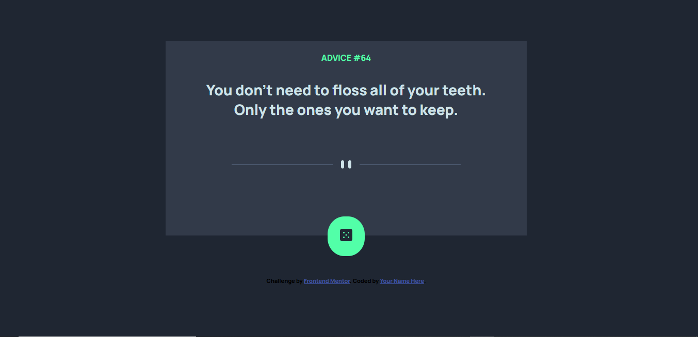
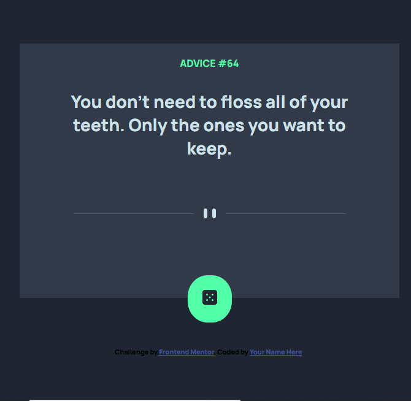

# Frontend Mentor - Advice generator app solution

This is a solution to the [Advice generator app challenge on Frontend Mentor](https://www.frontendmentor.io/challenges/advice-generator-app-QdUG-13db). Frontend Mentor challenges help you improve your coding skills by building realistic projects.

## Table of contents

- [Frontend Mentor - Advice generator app solution](#frontend-mentor---advice-generator-app-solution)
  - [Table of contents](#table-of-contents)
  - [Overview](#overview)
    - [The challenge](#the-challenge)
    - [Screenshot](#screenshot)
    - [Links](#links)
  - [My process](#my-process)
    - [Built with](#built-with)
    - [What I learned](#what-i-learned)
    - [Continued development](#continued-development)
    - [Useful resources](#useful-resources)
  - [Author](#author)
  - [Acknowledgments](#acknowledgments)


## Overview

### The challenge

Users should be able to:

- View the optimal layout for the app depending on their device's screen size
- See hover states for all interactive elements on the page
- Generate a new piece of advice by clicking the dice icon

### Screenshot

🖥 Desktop:




📱 Mobile:




### Links

- Solution URL: [My solution](https://www.frontendmentor.io/solutions/advice-generator-EKByhxtbXR)
- Live Site URL: [My live site](https://purplehippo911.github.io/adviceGenerator/)

## My process

### Built with

- Semantic HTML5 markup
- CSS custom properties
- Flexbox
- CSS Grid
- Mobile-first workflow
- Rest Api's

### What I learned

I learnt about two new html elements which I've never used before. The `<picture>` and `<source>`-elemnents. And I also got to practice on using promises with api's.     


```html
<picture>
        <source
            class="desktop"
            media="(min-width: 601px)"
            srcset="images/pattern-divider-desktop.svg"
        />
        <source
            class="mobile"
            media="(max-width: 550px)"
            srcset="images/pattern-divider-mobile.svg"
        />
        
</picture>
```
```js
function fetchAdvice() {
   fetch("https://api.adviceslip.com/advice")
      .then((response) => response.json())
      .then((response) => {
      const data = response.slip;
      const id = data.id;
      const advice = data.advice;

      adviceId.textContent = `#${id}`;
      adviceText.textContent = `${advice}`;
      console.log(id, advice);
    });
}

```

### Continued development

I will continue on learning more about js, so that I can become more comfortable using it. I'm currently learning asynchrounus js, and after that I'm thinking on starting with npm stuff.

### Useful resources

- [w3schools](https://www.w3schools.com/htmL/html_images_picture.asp) - This helped me understand a bit more about how to use the `<picture>`-element in HTML. 

## Author

- Frontend Mentor - [@purplehippo911](https://www.frontendmentor.io/profile/purplehippo911)

## Acknowledgments

Thanks to [@Evavic44](https://github.com/Evavic44) for his solution which helped me quite a lot with the promises I needed to make, and his solution inspired me to use the `<picture>` and `<source>` elements. Check out his solution here: [Evavic44's solution](https://github.com/Evavic44/advice-generator/blob/main/main.js)